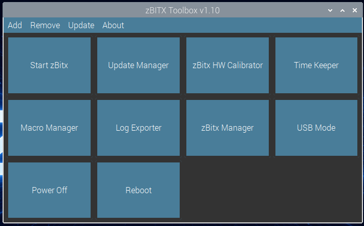

# zBitx Toolbox

A collection of handy applications designed for the **zBitx transceiver line** by **HF Signals**.  
Created and maintained by **JJ (W9JES)**. This is compatabile with the custom software and firmware located [Here](https://github.com/drexjj/zbitx)

This toolbox provides a unified set of utilities to manage, control, and enhance your zBitx experience — from calibration and logging to full remote operation.



---

## 🚀 Feature Overview
 
 
 
 
 
 
### 🧰 Toolbox Launcher
The **central hub** of the entire suite.

- Grid-based launcher for all tools and system actions  
- Start the zBitx app, run updates, export logs, calibrate hardware  
- Add/remove buttons and persist layout between sessions  
- Built-in toolbox self-update capability  

> Think of this as the **home screen** for your zBitx utilities.

---

### ⚙️ HW Calibrator
Fine-tune your transmit power across all bands.

- Band-by-band transmit power calibration (80M → 10M)  
- Editable scale values per band  
- Reads/writes directly to hardware settings  
- Start/stop the main zBitx application (with terminal output)  

> Essential when output power is uneven or after firmware changes.

---

### 📓 Log Exporter
Export your QSOs into industry-standard formats.

- Export to **ADIF (.adi)** for:
  - LoTW  
  - QRZ  
  - Club Log  
- Searchable and sortable QSO table  
- Date range filtering with calendar picker  
- Record validation (callsigns, dates, modes)  

> Cleanly move your contacts into logging software or award systems.

---

### 🧾 Macro Manager
Create and manage macro files for operating.

- Build and edit `.mc` macro files  
- Dropdown macro selector with descriptions  
- Syntax highlighting for recognized macros  
- Supports:
  - `{CALL}`, `{MYCALL}`, `{SENTRST}`, grid squares  
  - FT8 shortcut tokens  
- Standard file operations (New, Open, Save, Save As)  

> Perfect for contesting or everyday QSOs.

---

### 🎛️ Manager
Full-featured **remote control interface** for your zBitx.

- Network-based radio control  
- Memory system (frequency, mode, bandwidth, IF, AGC)  
- One-click tuning to saved channels  
- Full control over:
  - Frequency, VFO, mode, tuning step  
  - RIT, split, waterfall span  
  - AGC, audio, RF output  
  - F1–F12 macros  
- Built-in **FT8-style decoder**:
  - Save message logs  
- Memory scanning with adjustable dwell time  
- Dark and light (colorblind-friendly) themes  

> Your **desktop operating console** for zBitx.

---

### 🕒 Time Keeper
Keep your radio’s time accurate.

- Live system clock display  
- Hardware RTC management  
- Sync options:
  - System → RTC  
  - Manual time set  
  - Internet (NTP) sync  

> Critical for digital modes like **FT8**.

---

### 🔄 Update Manager
Keep your system up to date without the command line.

- System update & upgrade  
- zBitx application updates  
- Live terminal output view  
- Progress bar for running tasks  

> Simple, visual system maintenance.

---

### 🔌 USB Mode
Switch the function of the USB port.

- **CAT Mode**
  - Virtual COM port + audio interface  
  - Compatible with logging/digital software  
  - Emulates **Icom IC-746** (CI-V address 56)  
  - Audio devices:
    - Input: *USB Microphone*  
    - Output: *Speaker SINK*  

- **Mouse/Keyboard Mode**
  - Use USB input devices directly with the radio  

- One-click switching  
- Color-coded status indicator  
- Requires reboot after change  
- CLI support:
  ```bash
  --status
  --cat
  --mouse
  ```

> Easily switch between **computer-controlled** and **standalone operation**.

---

## 📦 Installation

*(Add your install steps here — clone, script, image, etc.)*

```bash
git clone https://github.com/your-repo/zbitx-toolbox.git
cd zbitx-toolbox
sudo chmod +x ./install.sh
./install.sh
```

---

## 🧪 Status

- Actively developed  
- Designed for real-world use and field operation  
- Feedback and bug reports are welcome  

---

## 📜 License

Closed source, copyrighted software. Please see my [License](https://github.com/drexjj/zbitx-toolbox/blob/main/LICENSE) for more information.

---

## 📡 Acknowledgments

- **HF Signals** for the zBitx platform  
- The amateur radio community for testing and feedback  

---

## 🌟 Support the Project

If you find these enhancements valuable or have benefited from using them, then please consider supporting my work. Every donation, big or small, helps us keep development going.

💖 [**Donate Here**](https://www.paypal.com/donate/?hosted_button_id=SWPB76LVNUHEY) 💖

Can't donate? No worries! Spreading the word also makes a big impact.

Thank you for your support and belief in this project!

